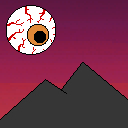
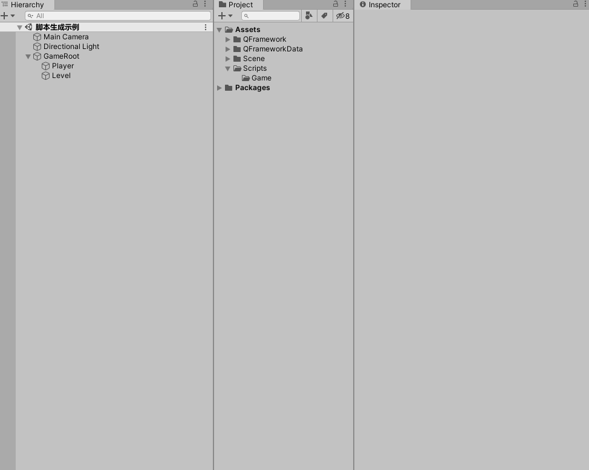
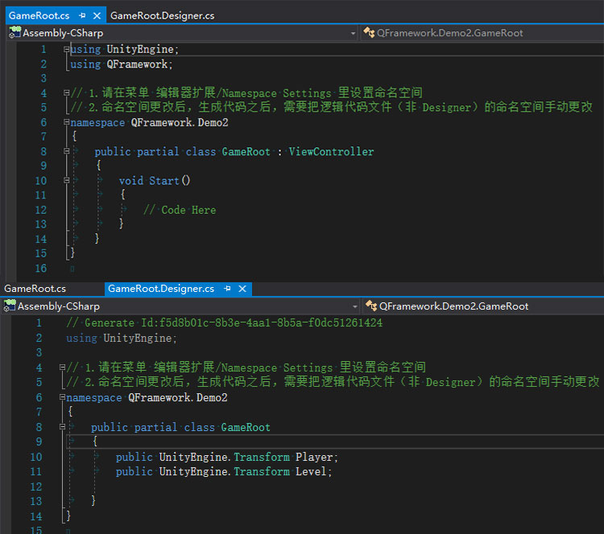
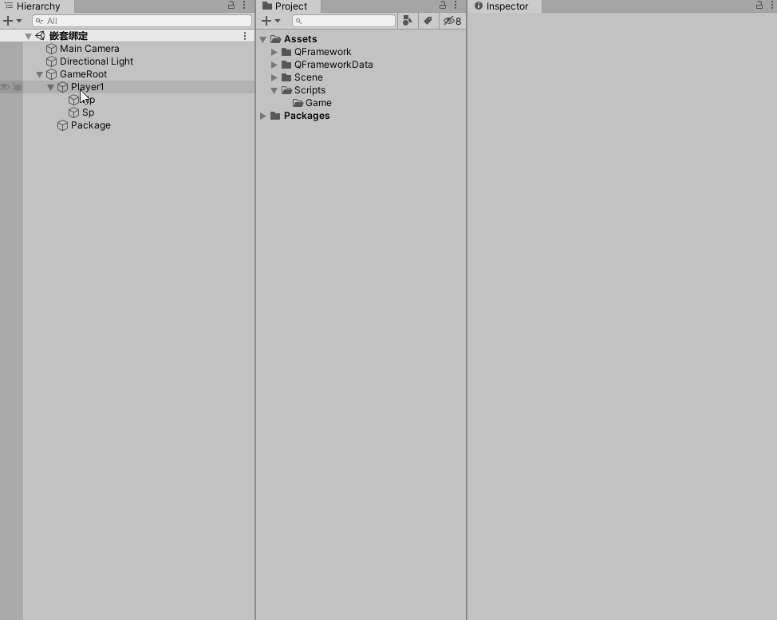
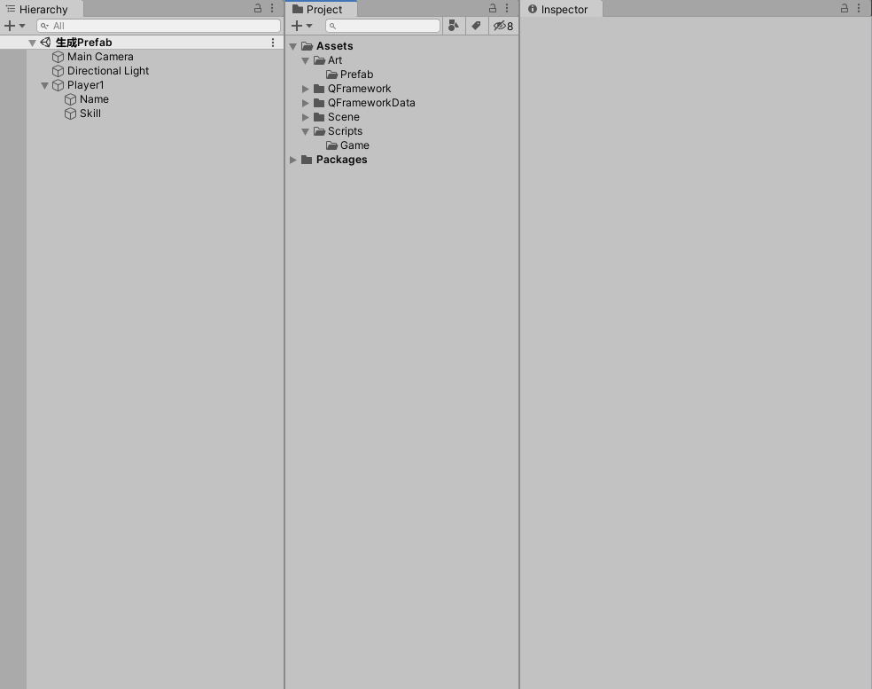
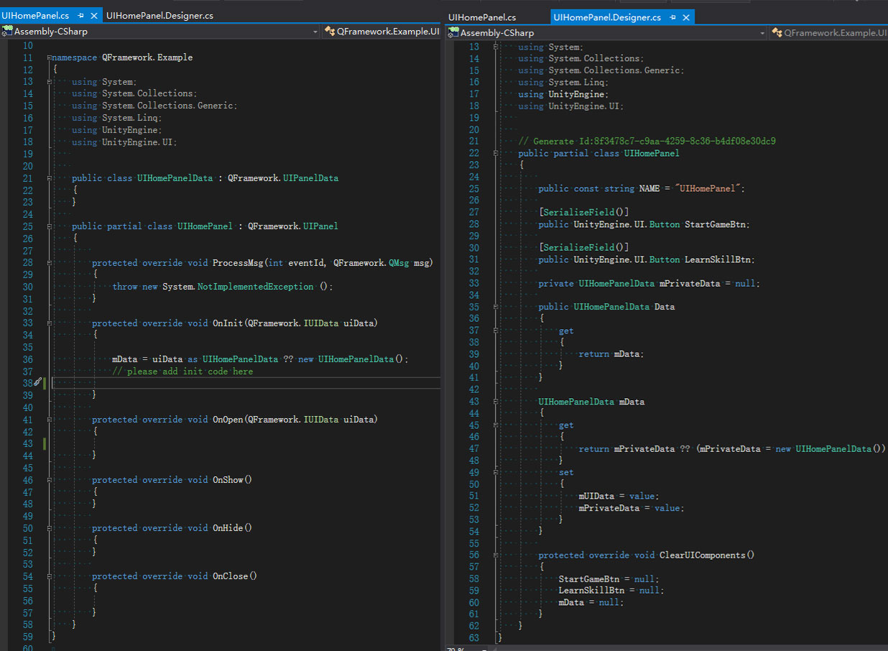
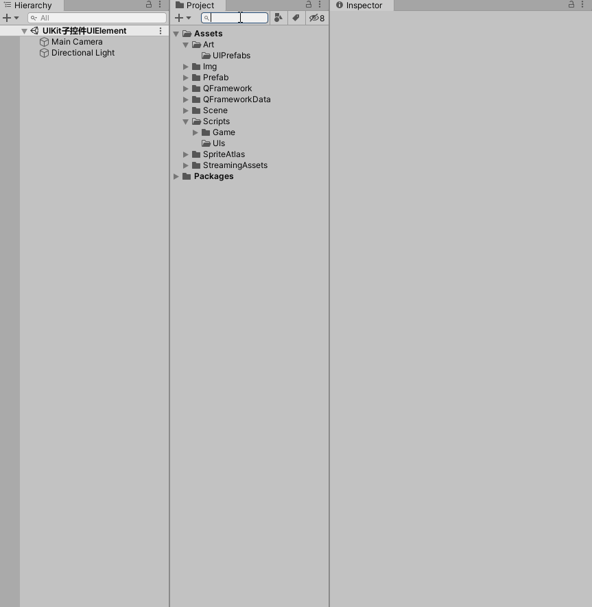

[](https://github.com/liangxiegame/QFramework/blob/master/LICENSE)
[](https://travis-ci.org/liangxiegame/QFramework)
[](https://coveralls.io/github/liangxiegame/QFramework?branch=master)

# QFramework 简介 Intro
  [QFramework](https://github.com/liangxiegame/QFramework) 是一套 **渐进式** 的 **快速开发** 框架。目标是作为无框架经验的公司、独立开发者、以及 Unity3D 初学者们的 **第一套框架**。框架内部积累了多个项目的在各个技术方向的解决方案。学习成本低，接入成本低，重构成本低，二次开发成本低，文档内容丰富(提供使用方式以及原理、开发文档)、插件丰富。github:https://github.com/liangxiegame/QFramework

  [QFramework](https://github.com/liangxiegame/QFramework) is a **Progressive** and **RAD** framework.Goal is become indie developer and fresh man's **The First Framework**。It's include many project's tech solution.Easy 2 Learn,Easy 2 Install,Easy 2 Refactor,Easy 2 Modify,Feature Packed documents and plugins. github:https://github.com/liangxiegame/QFramework

[码云国内镜像仓:https://gitee.com/liangxiegame/QFramework](https://gitee.com/liangxiegame/QFramework)

### ShowCase（商业案例）
| [鬼山之下](https://store.steampowered.com/app/1517160/_/) | [谐音梗挑战](https://www.taptap.com/app/201075) |
| :-------------------------------------------------------: | :---------------------------------------------: |
|                 |     |

## Star 趋势（如果项目有帮到您欢迎点赞）

[](https://starchart.cc/liangxiegame/QFramework)

#### 快速图解:

**1.ViewController和Bind的基本使用 自动生成脚本**

 

自动生成的脚本如下：

 

**2.ViewController和ViewController的嵌套使用**

 

自动生成的脚本如下：

 

**3.自动生成Prefab**

 

**4.使用UIKit创建Prefab和脚本**

 

自动生成的脚本如下：

 

**5.使用UIKit子控件UIElement**

 

#### 快速开始 QuickStart:

**1.Action Kit**

* chainning style(Driven by MonoBehaviour or Update)

``` csharp
this.Sequence()
	.Delay(1.0f)
	.Event(()=>Log.I("Delayed 1 second"))
	.Until(()=>something is done)
	.Begin();
```

* object oriented style

``` csharp
var sequenceNode = new SequenceNode();
sequenceNode.Append(DelayAction.Allocate(1.0f));
sequenceNode.Append(EventAction.Allocate(()=>Log.I("Delayed 1 second"));
sequenceNode.Append(UntilAction.Allocate(()=>something is true));

this.ExecuteNode(sequenceNode);
```

**2.Res Kit**
``` csharp
// allocate a loader when initialize a panel or a monobehavour
var loader = ResLoader.Allocate();

// load someth in a panel or a monobehaviour
loader.LoadSync<GameObject>("resources://smobj");

loader.LoadSync<Texture2D>("resources://Bg");

// load by asset bundle's assetName
loader.LoadSync<Texture2D>("HomeBg");

// load by asset bundle name and assetName
loader.LoadSync<Texture2D>("home","HomeBg");


// resycle this panel/monobehaivour's loaded res when destroyed 
loader.Recycle2Cache();
loader = null;
```

**3.UI Kit**

``` csharp
// open a panel from assetBundle
UIKit.OpenPanel<UIMainPanel>();

// load a panel from specified Resources
UIKit.OpenPanel<UIMainPanel>(prefabName:"Resources/UIMainPanel");

// load a panel from specield assetName
UIKit.OpenPanel<UIMainPanel>(prefabName:"UIMainPanel1");
```

### 技术支持 Tech Support：
* [文档 Document:http://qf.liangxiegame.com/qf/community](http://qf.liangxiegame.com/qf/community)
* **如在使用中遇到问题请提交 [这里 issue](https://github.com/liangxiegame/QFramework/issues/new)，我们团队会在一天内快速回复并着手解决。**
* **[QQ 群:623597263](http://shang.qq.com/wpa/qunwpa?idkey=706b8eef0fff3fe4be9ce27c8702ad7d8cc1bceabe3b7c0430ec9559b3a9ce66) **：在 QQ 群内提问，会马航内得到回复。
* **社区:https://liangxiegame.com/qf/intro/**
* [awesome_qframework](https://github.com/liangxiegame/awesome-qframework)  

#### 下载地址 Download:
* 最新版本:https://github.com/liangxiegame/QFramework/releases
* [Asset Store](http://u3d.as/SJ9)

### 赞助 Donate:
* 如果觉得不错可以在 [这里 Asset Store](http://u3d.as/SJ9) 给个 5 星哦~ give 5 star
* 或者给此仓库一个小小的 Star~ star this repository
* 以上这些都会转化成我们的动力,提供更好的技术服务! 

### 运行环境
* Unity 5.6.x ~ 2020.x

### 可选的包含项目 Include Projects:
* [UniRx](https://github.com/neuecc/UniRx)
* [Json.net](https://github.com/JamesNK/Newtonsoft.Json)

#### 参考 Reference:
* [MultyFramework](https://github.com/OnClick9927/MultyFramework)
* [IFramework_GUICanvas](https://github.com/OnClick9927/IFramework_GUICanvas)
* [IFramework](https://github.com/OnClick9927/IFramework)
* [Loxodon Framework](https://github.com/cocowolf/loxodon-framework)
* [BDFramework](https://github.com/yimengfan/BDFramework.Core)
* [HGFramework: Unity3D客户端框架](https://github.com/zhutaorun/HGFramework)
* [Qarth: Framework For Game Develop With Unity3d](https://github.com/SnowCold/Qarth)
* [GameFramework:A game framework based on Unity 5.3 and later versions](https://github.com/EllanJiang/GameFramework)
* [cocos2d/cocos2d-x](https://github.com/cocos2d/cocos2d-x)
* [ResetCore.Unity](https://github.com/vgvgvvv/ResetCore.Unity)
* [UnityUGUIImageShaderPack](https://github.com/zhangmaker/UnityUGUIImageShaderPack)
* [FishManShaderTutorial](https://github.com/JiepengTan/FishManShaderTutorial)

### 贡献者/感谢 Developer/Contributor:
- [@karsion](https://github.com/karsion)
- [@junyu-tu](https://github.com/junyu-tu)
- [@vin129](https://github.com/vin129)
- [@kevin](https://github.com/KEVIN-ZED)
- [@827922094](https://github.com/827922094)
- [@SilenceT](https://github.com/SilenceT)
- [@liangxie](https://github.com/liangxieq)


### 优秀的 Unity 库、框架
- [ET](https://github.com/egametang/ET)：ET Unity3D Client And C# Server Framework
- [xasset](https://github.com/xasset/xasset): xasset 致力于为 Unity 项目提供一套精简稳健的资源管理环境
- [TinaX](https://github.com/yomunsam/TinaX): 开箱即用的 Unity 开发框架，支持 Lua。
- [IFramework（OnClick）](https://github.com/OnClick9927/IFramework) Simple Unity Tools
- [JEngine](https://github.com/JasonXuDeveloper/JEngine) JEngine is a streamlined and easy-to-use framework designed for Unity Programmers.

### 代码规范完全遵循:
[QCSharpStyleGuide](https://github.com/liangxiegame/QCSharpStyleGuide)
