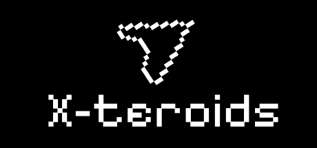
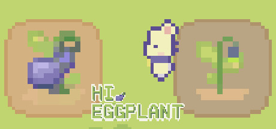
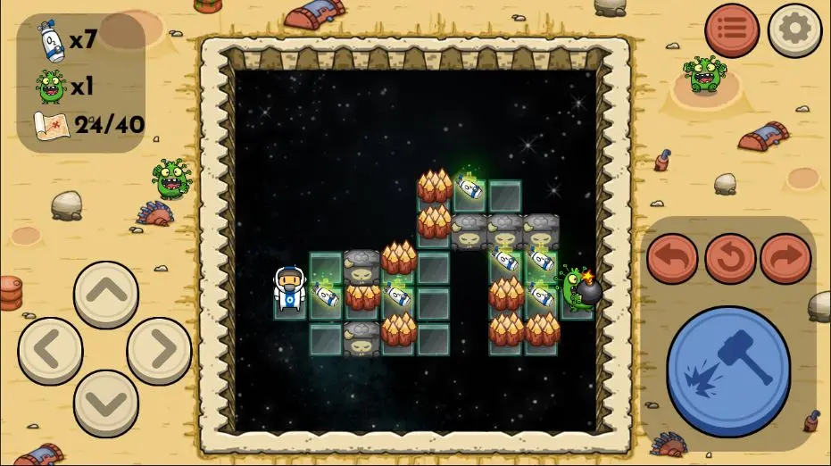
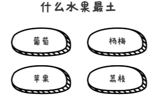

# QFramework 简介 Intro

[中文]()|[English](README_EN.md)

[QFramework](https://github.com/liangxiegame/QFramework) 是提供一套简单、强大、易上手、符合 SOLID 原则、支持领域驱动设计（DDD）、事件驱动、数据驱动、分层、MVC 、CQRS、模块化、易扩展的架构，她的源码只有不到 1000 行，你可以完全把她放在你的笔记应用里保存。

## 提供的架构图

## 举个例子（一图胜千言😂）

## 各种情况的示意图

## 架构使用规范

**QFramework系统设计架构分为四层及其规则：**

* 表现层：ViewController层。IController接口，负责接收输入和状态变化时的表现，一般情况下，MonoBehaviour 均为表现层
    * 可以获取System
    * 可以获取Model
    * 可以发送Command
    * 可以监听Event
* 系统层：System层。ISystem接口，帮助IController承担一部分逻辑，在多个表现层共享的逻辑，比如计时系统、商城系统、成就系统等
    * 可以获取System
    * 可以获取Model
    * 可以监听Event
    * 可以发送Event
* 数据层：Model层。IModel接口，负责数据的定义、数据的增删查改方法的提供
    * 可以获取Utility
    * 可以发送Event
* 工具层：Utility层。IUtility接口，负责提供基础设施，比如存储方法、序列化方法、网络连接方法、蓝牙方法、SDK、框架继承等。啥都干不了，可以集成第三方库，或者封装API
* 除了四个层级，还有一个核心概念——Command
    * 可以获取System
    * 可以获取Model
    * 可以发送Event
    * 可以发送Command
* 层级规则：
    * IController 更改 ISystem、IModel 的状态必须用Command
    * ISystem、IModel状态发生变更后通知IController必须用事件或BindableProperty
    * IController可以获取ISystem、IModel对象来进行数据查询
    * ICommand不能有状态
    * 上层可以直接获取下层，下层不能获取上层对象
    * 下层向上层通信用事件
    * 上层向下层通信用方法调用（只是做查询，状态变更用Command），IController的交互逻辑为特别情况，只能用Command

（照抄自：[学生课堂笔记1](https://github.com/Haogehaojiu/FrameworkDesign)）

### 运行环境

* Unity 2018.4.x ~ Unity 6.x

## 安装

* QFramework.cs 
    * 直接复制[此代码](QFramework.cs)到自己项目中的任意脚本中
* QFramework.cs 与 官方示例
    * [点此下载 unitypackage](./QFramework.cs.Examples.unitypackage)

* QFramework.ToolKits
    * [点此下载 unitypackage](./QFramework.Toolkits.unitypackage)
* QFramework.ToolKitsPro
    * 从 [AssetStore](http://u3d.as/SJ9) 安装

## 资源

| **版本** |                                      |                                                          |
| ----------------------  | ---------------------------------------- | ------------------------------------------------------------ |
| QFramework.cs | QFramework 本体架构的实现 | [文件](QFramework.cs) |
| QFramework.cs  示例 | QFramework.cs 与官方示例： CounterApp、《点点点》、FlappyBird、CubeMaster、ShootingEditor2D、贪吃蛇等 | [点此下载 unitypackage](./QFramework.cs.Examples.unitypackage) |
| QFramework.Toolkits | QFramework  集成 CoreKit/UIKit/ActionKit/ResKit/PackageKit/AudioKit 等全部官方工具（已包含 QFramework.cs 和 示例) | [点此下载 unitypackage](./QFramework.Toolkits.unitypackage) |
| QFramework.Toolkits.Demo.WuZiQi | 使用 QFramework.Toolkits 开发的五子棋 Demo（需要安装好  QFramework.Toolkits） | [点此下载 unitypackage](./QFramework.Toolkits.Demo.WuZiQi.unitypackage) |
| QFramework.Toolkits.Demo.Saolei | 使用 QFramework.Toolkits 开发的扫雷 Demo（需要安装好  QFramework.Toolkits） | [点此下载 unitypackage](./QFramework.Toolkits.Demo.SaoLei.unitypackage) |
| QFramework.ToolKitsPro | 在 ToolKits 基础上集成更多好用的工具的版本（已包含 QFramework.Toolkits） | [AssetStore](http://u3d.as/SJ9) |
| **群友案例** |  |  |
| 赛车游戏《Crazy Car》 | 群友 [TastSong](https://github.com/TastSong) 使用 QF 进行重构的开源赛车游戏 | [游戏主页(Github](https://github.com/TastSong/CrazyCar)) |
| **社区** |  |  |
| QQ 群1（已满）：623597263 | 交流群 | [点击加群](https://qm.qq.com/cgi-bin/qm/qr?k=G4DZ_6qMbN8miP8RcRD9NdhNcVyrD88F&jump_from=webapi&authKey=P8WO3esK/KbDxWPHI5F3EC04IPT6jDSkk/tl73/EHIcRkMTvnLhwpTK1PtHr6V+p) |
| QQ 群2：541745166 | 交流群 | [点击加群](https://qm.qq.com/q/VI5Od3rri4) |
| 腾讯频道 | 中文社区 | [点击加入频道](https://pd.qq.com/s/cfe1690jf) |
| Discord | 英文社区 | [点击加入频道](https://discord.gg/PHqHX5v5SE) |
| **教程** |  |  |
| 《框架搭建 决定版》    | 教程 QFramework  的核心架构是怎么演化过来的？ | [课程主页](https://learn.u3d.cn/tutorial/framework_design)\|[学生课堂笔记1](https://github.com/Haogehaojiu/FrameworkDesign)\|[学生课堂笔记2](https://github.com/Haogehaojiu/ShootingEditor2D) |
| **产品案例** | 如果用了 qf 并且想要在如下列表中登记，可以在 github/gitee 的 issue 里发帖子,也可以加 qq 群，也可以用邮箱联系凉鞋 liangxiegame@163.com，当然如果看到使用 qf 的项目，我也会先去尝试征得同意再放到如下列表。 |  |
|  | 独立游戏《观鸟笔记》 | [Steam](https://store.steampowered.com/app/4111370/) |
|  | 独立游戏《乌合之众》 | [Steam](https://store.steampowered.com/app/1741170/_/) |
|  | 独立游戏《银河摸鱼人》 | [Steam](https://store.steampowered.com/app/1731000/) |
|  | 独立游戏《ScaleBox》 | [Steam](https://store.steampowered.com/app/3528380/ScaleBox/) |
|  | 独立游戏《我的玫瑰》 | [Steam](https://store.steampowered.com/app/3246640/_/) |
|  | 独立游戏《蚀界档案》 | [TapTap](https://www.taptap.cn/app/222365) \|[Steam](https://store.steampowered.com/app/1976540/_/) |
|  | 独立游戏《盒子面包坊》 | [TapTap](https://www.taptap.cn/app/384085) \| [Steam](https://store.steampowered.com/app/2942950/_/) |
|  | 独立游戏《X-teriods》 | [Steam](https://store.steampowered.com/app/3342540/Xteroids/) |
|  | 独立游戏《你好茄子：精灵的诞生》 | [Steam](https://store.steampowered.com/app/2375290/_/) |
|  | 独立游戏《当火车鸣笛三秒》 | [Steam](https://store.steampowered.com/app/1563700/_/)\|[TapTap](https://www.taptap.cn/app/208258) |
|  | 独立游戏《你好茄子》 | [Steam](https://store.steampowered.com/app/2091640/Hi_Eggplant/) |
|  | 独立游戏《第一座山》 | [Steam](https://store.steampowered.com/app/2149980/The_First_Mountain/) |
|  | 独立游戏《推灭泡泡姆》 | [TapTap](https://www.taptap.com/app/233228) |
|  | 独立游戏《鬼山之下》 | [Steam](https://store.steampowered.com/app/1517160/_/) |
|  | 手机游戏《谐音梗挑战》 | [TapTap](https://www.taptap.com/app/201075)        |
| **其他相关教程** |  |  |
| 《独立游戏体验计划》（猫叔） | 独立游戏制作体验教程，有用到 QFramework.cs | [b 站](https://space.bilibili.com/656352) |
| 《原创独立游戏制作：平台射击 Roguelike》（凉鞋） | 原创独立游戏制作教程，有用到 QFramework.cs | [b 站](https://space.bilibili.com/60450548/channel/collectiondetail?sid=125221) |
| 《原创独立游戏制作：类星露谷》（凉鞋） | 原创独立游戏制作教程，有用到 PlayMaker、QFramework.Tookits | [b 站](https://space.bilibili.com/60450548/channel/collectiondetail?sid=919279) |
| 《QFramework 游戏开发：类幸存者》 | 面向 QFramework 的游戏开发教程，完成一款类吸血鬼幸存者游戏。 | [b 站](https://www.bilibili.com/video/BV1Uu4y1i7WH/) |
| 《QFramework 教程会员》 | QFramework 相关的课程案例 | [GamePix](https://www.gamepixedu.com/vip/?levelId=1) |

## Star 趋势（如果项目有帮到您欢迎点赞）

### 作者

* [凉鞋 liangxiegame](https://github.com/liangxiegame)

### 贡献者

* [京产肠饭]( https://gitee.com/JingChanChangFan/hk_-unity-tools)

* [猫叔(一只皮皮虾)]( https://space.bilibili.com/656352/)

* [TastSong]( https://github.com/TastSong)

* [misakiMeiii](https://github.com/misakiMeiii)

* [soso](https://github.com/so-sos-so)

* [蓝色孤舟 gdtdftdqtd](https://github.com/gdtdftdqtd)

* [h3166179](https://github.com/h3166179)

* [葫芦 WangEdgar](https://github.com/WangEdgar)

* New一天

* 幽飞冷凝雪～冷

### 优秀的 Unity 库、框架

- [ET](https://github.com/egametang/ET)：ET Unity3D Client And C# Server Framework
- [IFramework（OnClick）](https://github.com/OnClick9927/IFramework) Simple Unity Tools
- [JEngine](https://github.com/JasonXuDeveloper/JEngine)  使Unity开发的游戏支持热更新的解决方案。
- [TinaX Framework](https://tinax.corala.space/) “开箱即用”的Unity独立游戏开发工具

### 代码规范完全遵循:

[QCSharpStyleGuide](https://github.com/liangxiegame/QCSharpStyleGuide)

### 赞助 Donate:

* 如果觉得不错可以在 [这里 Asset Store](http://u3d.as/SJ9) 给个 5 星哦~ give 5 star
* 或者给此仓库一个小小的 Star~ star this repository
* 以上这些都会转化成我们的动力,提供更好的技术服务! 

### 鸣谢

感谢 JetBrains 公司提供的使用许可证！

感谢 OpenAI 通过 Codex for OSS 计划对本项目的开源维护提供支持。

感谢 GitHub Copilot 对本项目开源维护提供支持。

本开源项目由 [QFramework 教程年会员](https://www.gamepixedu.com/goods/show/55) 提供资助
